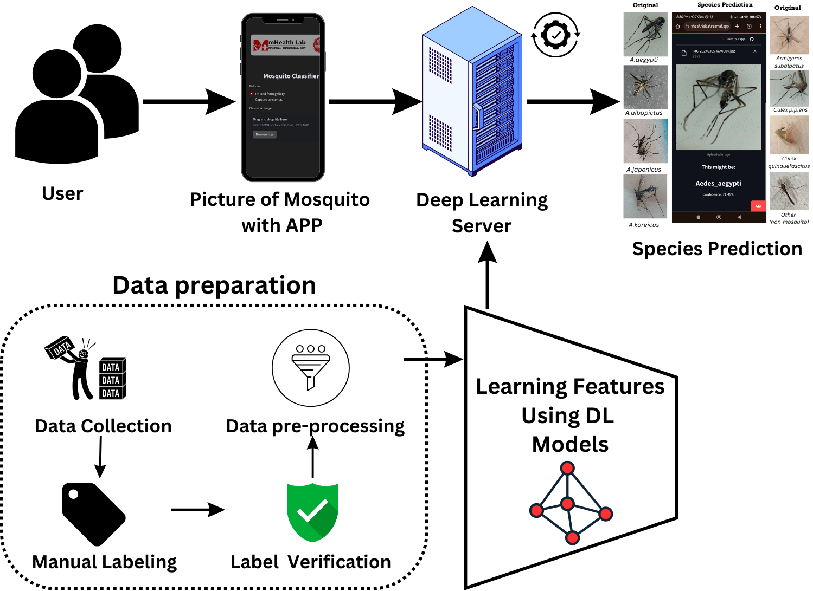
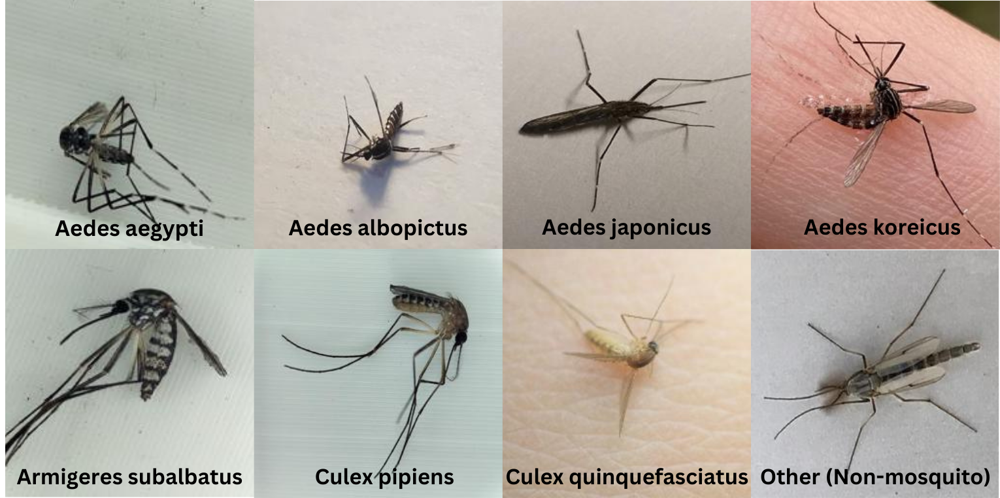
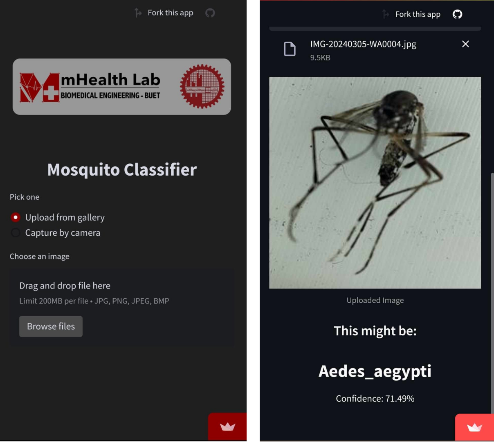

# Aedes Mosquito Image Dataset Version 1.0 (AMID v1.0)

# Introduction

The outbreak of dengue fever in recent years has become a grave public health concern as it has spread to 20 countries in South America and South Asia. As vectors of the flavivirus, several mosquito species belonging to the Aedes genus are responsible for transmitting dengue fever. Effective vector surveillance and control are essential in reducing dengue outbreaks. However, due to their minute variations in anatomical structure, it is challenging to identify Aedes mosquitoes without expert entomologists using a microscope. In this regard, deep learning algorithms can play a vital role in identifying mosquitoes using smartphone-captured images and pave the way for deskilling automated vector surveillance, provided that sufficient training examples are available. 

A graphical representation of our working pipeline:  

* * *

# Contents

In this study, we developed the “Aedes Mosquito Image Dataset,” consisting of smartphone-captured mosquito images consisting of 8 class labels: Aedes aegypti, Aedes koreicus, Aedes albopictus, Culex pipiens, Armigeres subalbatus, Culex quinquifasciatus, Aedes japonicus, and others (non-mosquito). The images are collected by trapping mosquitoes in several locations in Dhaka, followed by image capture and expert annotations in collaboration with ICDDR,B. Additional image data is collected from open-access online repositories. 

Some sample images from dataset:  

* * *

# Dataset Description

The dataset contains a total of 31999 images from 3 sources. The class distribution is presented as follows:
| Class label                     | No. of Images from Mosquito Alert | No. of Images from ICDDR,B | No. of Images from WHO | Total No. of Images (Class label Wise) |
|---------------------------------|-----------------------------------|----------------------------|-------------------------|----------------------------------------|
| *Aedes aegypti*                   | 73                                | 247                        | 499                     | **819**                                    |
| *Aedes albopictus*                | 15,268                            | 7                          | 500                     | **15,775**                                 |
| *Aedes japonicus*                 | 153                               | 0                          | 0                       | **153**                                    |
| *Aedes koreicus*                  | 38                                | 0                          | 0                       | **38**                                     |
| *Armigeres subalbatus*            | 0                                 | 42                         | 0                       | **42**                                     |
| *Culex pipiens*                   | 6,180                             | 231                        | 0                       | **6,411**                                  |
| *Culex quinquefasciatus*          | 0                                 | 0                          | 500                     | **500**                                    |
| Others (non-mosquito)           | 8,261                             | 0                          | 0                       | **8,261**                                  |
| **Total No. of Images (Source Wise)** | **29,973**                       | **527**                    | **1,499**               | **31,999**                             |

This dataset has 8 subfolders, which contain 7 kinds of mosquito images and 1 folder (other_species) for non-mosquito images.

* * *

# Source

The dataset was constructed by sourcing images from [Mosquito Alert](https://www.mosquitoalert.com/en/mosquito-images-dataset/), [WHO accredited breeding laboratory](https://data.mendeley.com/datasets/zw4p9kj6nt/2) & Trap set up by ICDDR,B. Each image was meticulously recorded along with its respective source information to facilitate further verification and ensure proper attribution. Copyright considerations were duly addressed, adhering to appropriate protocols to safeguard intellectual property rights.

* * *

# Naming Convention of the Images

Each image is assigned a name following the format of SourceCode_ClassLabel_Cropped_CroppingNumber_Resized. The corresponding source codes assigned to each source are: Mosquito Alert -&gt; MSA; ICDDR,B -&gt; ICD; WHO accredited breeding laboratory -&gt; WHO. For instance, an image named "ICD_Aedes_aegypti_Cropped_239_Resized" indicates that it was collected from ICDDR,B, belongs to the *Aedes aegypti* class, cropped using YOLO, cropping id was 239 & finally it was resized to 256 by 256.

* * *

#Collection Methodology

In AMID v1.0, our mosquito images are collected by setting up traps in various locations within ICDDR,B, Bangladesh University of Engineering and Technology (BUET) and University of Dhaka (DU). We utilized BG-Sentinel traps containing human sweat extract that attracted Aedes mosquitoes. Additional mosquito image samples were collected from the open-access dataset “Mosquito Alert" and images provided by WHO accredited breeding laboratory. We did not use any automatic web scrapers. In this work, we mainly focus on distinguishing Aedes mosquitoes like *Aedes aegypti, Aedes koreicus, Aedes albopictus,* and *Aedes japonicus* from other mosquito species. Entomologists in ICDDR,B and the entomology department at the University of Dhaka properly verified & labeled all the images of mosquitoes. Through a two-step screening process, out of focus, low-resolution images devoid of mosquito information and low-quality images are discarded, and only the unique images that meet the quality requirements are selected. Next, the images were cropped according to the region of interest by the YOLO model and resized to 256 × 256 pixels, maintaining the aspect ratio. 

* * *

#Web-Application

A web app prototype has already been created using the open-source Python streamlit framework with a flask core, and it has been hosted on the streamlit server for an improved user experience, since our goal is to create an end-to-end solution that begins with dataset creation and ends with a live web application. 

